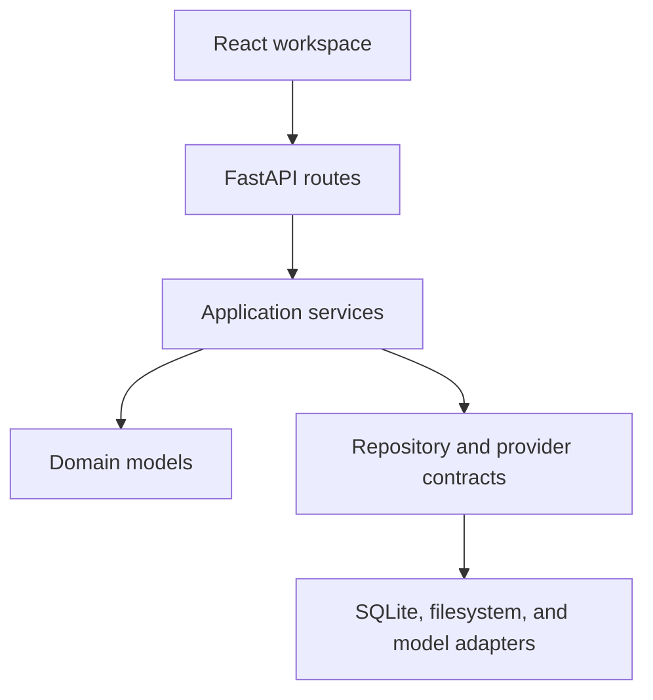

# Architecture

OpenStory Studio is a stateful narrative-production application, not an image-generation
wrapper. Source, canon, adaptation decisions, approval state, provenance, and render
history remain useful when every configured model changes.

## Dependency direction



Dependencies point inward. Domain modules do not import FastAPI, SQLAlchemy, MLX,
OpenAI-compatible clients, or any image runtime. Application services coordinate one use
case each; there is deliberately no giant pipeline module.

## Runtime layers

| Layer | Responsibility |
| --- | --- |
| Domain | Pydantic models, temporal canon, status rules, render metadata |
| Application | Ingest, extract, adapt, storyboard, render, and export use cases |
| Provider ports | Structured text and image-generation protocols |
| Provider adapters | Deterministic mocks, OpenAI-compatible HTTP, placeholder PNG, MLX-Gen CLI |
| Persistence | SQLAlchemy records, repositories, SQLite transactions |
| Filesystem | Imported sources, immutable renders, atomic versioned exports |
| API/UI | Transport validation and human review workspace |

## Request flow

API routes validate transport input and create a `Job` for model-backed or export work.
`RunJobService` records queued, running, succeeded, or failed state. Application services
load validated domain objects through `OpenStoryRepository`, call a provider only through
its protocol, then persist results. Provider exceptions never make generated content
authoritative.

The React application consumes the API as structured JSON. Markdown exists only as an
export view; it is never the canonical production store.

## Persistence boundaries

SQLite stores queryable production state. Each project also receives a local workspace:

```text
workspaces/<project-id>/
├── source/
├── canon/
├── episodes/
├── assets/
├── renders/
└── exports/
```

Imported source files and model outputs are outside Git by default. Render regeneration
allocates another `vNNN.png`; it does not mutate an existing file. Episode exports are
built under a temporary directory, verified, then atomically renamed to a new version.

## Provider isolation

`TextGenerationProvider.generate_structured` receives prompts and a Pydantic schema. The
OpenAI-compatible adapter requests plain JSON, validates it, and performs one bounded
repair attempt. Domain code never knows which text model served the request.

`ImageGenerationProvider.generate` writes a requested image path and returns validated
metadata. Placeholder rendering is the required default. The MLX-Gen adapter checks CLI
availability, uses `asyncio.create_subprocess_exec` with positional arguments, captures
bounded output, and verifies the PNG before returning.

## Failure model

- Missing optional AI runtimes do not prevent API startup.
- Every model-backed failure is visible through its failed job.
- Model output must validate before persistence.
- Locked panels cannot be replaced or rendered over.
- Approved and locked render files remain immutable.
- Export fails clearly if any existing storyboard panel lacks a usable render.
