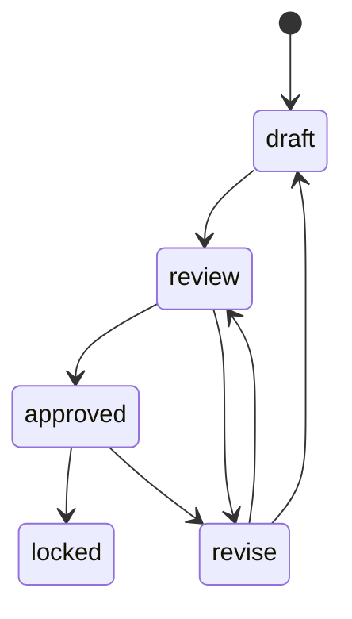

# Domain Model

The first milestone uses a deliberately small polymorphic canon model and explicit
production artifacts. It leaves room for continuity and reusable asset versions without
prematurely creating dozens of specialized tables.

## Core production graph

| Artifact | Key responsibility |
| --- | --- |
| `Project` | Owns source, canon, target format, and workspace |
| `SourceDocument` | Records local filename, content hash, and workspace path |
| `SourceChunk` | Preserves ordered text plus exact document offsets |
| `CanonEntity` | Represents a character, location, object, faction, creature, or concept |
| `CanonFact` | Links a subject to an entity/value with evidence and temporal validity |
| `Episode` | Records selected source chunks and explicit adaptation notes |
| `Scene` | Orders visual dramatic units within an episode |
| `StoryboardPanel` | Stores production-ready shot, action, dialogue, and prompt data |
| `RenderVersion` | Identifies one immutable generated image and its metadata |
| `Job` | Makes queued, running, succeeded, and failed work visible |

## Source ordering and provenance

Chunk ordinals are project-wide, not reset per document. Markdown headings and recognized
plain-text chapter markers create natural boundaries; bounded paragraph chunks are the
fallback.

Every `CanonFact` requires:

- its source chunk ID;
- the exact evidence text;
- a confidence from 0 to 1;
- source document offsets through the referenced chunk.

Entity resolution is conservative. Canonical names are normalized for whitespace and
case, then aliases are checked. Ambiguous adaptation or storyboard references fail
validation instead of inventing a match.

## Temporal canon

`valid_from_ordinal` and `valid_to_ordinal` are inclusive. Either bound may be absent.
The snapshot at ordinal `t` includes a fact only when:

\[
(from\ is\ absent \lor from \le t) \land (to\ is\ absent \lor t \le to)
\]

Episode adaptation and storyboard construction use the maximum ordinal of their selected
source chunks. This prevents later-story knowledge from contaminating earlier work.

## Human authority



`locked` has no outgoing transition. AI output begins as draft and cannot silently become
approved. Replacing a storyboard requires every existing panel to remain draft. Rendering
a locked panel is rejected before a provider is invoked.

## Render versions

Each panel owns monotonically increasing render versions. The file layout is:

```text
renders/<scene-id>/panel-0001/
├── v001.png
├── v002.png
└── …
```

Regeneration allocates a new path and deterministic seed. Approval changes only database
state; it does not modify PNG bytes.

Export selection is deterministic:

1. locked;
2. approved;
3. review;
4. revise;
5. draft;
6. highest version within the winning status.

Missing files are not eligible.

## Export package

`episode.json` validates as an `ExportBundle` containing the project, selected sources,
the temporal canon snapshot, episode, ordered scenes, ordered panels, and selected render
records. `episode.md` is a presentation view with relative storyboard links.
`manifest.json` records the export version, source hashes, render IDs, timestamp, and exact
files. A second export creates `v002`; existing packages are never overwritten.

## Continuity reserved for milestone two

The current polymorphic entity/fact model can represent appearance, outfit, injury,
ownership, relationship, knowledge, and location state over time. A future continuity
validator will compare panels and approved assets to this narrative state at `t`; it will
not reduce continuity to image similarity.
