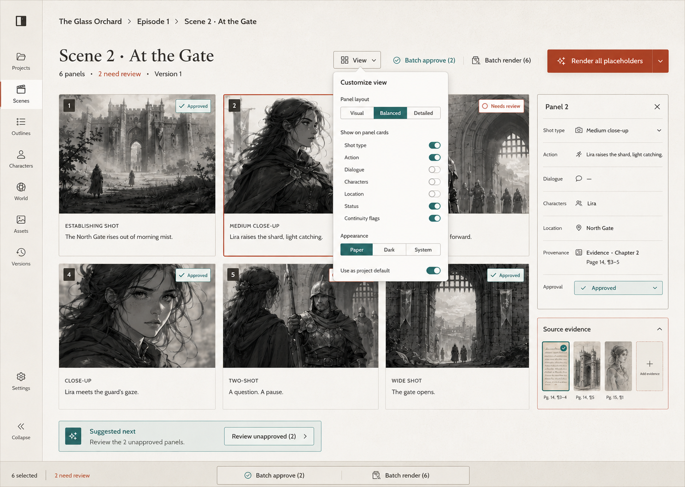

# OpenStory Studio — Milestone One Design

**Date:** 2026-08-10  
**Status:** Approved for implementation  
**Repository:** `PrinceJonaa/openstory-studio`  
**License:** Apache-2.0

## 1. Outcome

OpenStory Studio is a local-first narrative-production system whose durable product is structured story and production state, not any individual AI model.

Milestone one proves one complete path:

```text
TXT/Markdown
→ source chunks
→ canon entities and temporal facts with evidence
→ episode and scenes
→ storyboard panels
→ versioned placeholder PNGs
→ JSON, Markdown, and image export
```

The path must work with deterministic mocks and no model downloads. An OpenAI-compatible local text provider and an MLX-Gen subprocess adapter are optional runtime enhancements behind provider interfaces.

The public repository uses only an original two-chapter fixture. Personally imported or copyrighted source material remains in ignored project workspaces.

## 2. Scope Boundary

Milestone one includes:

- project creation and isolated workspaces;
- TXT and Markdown ingestion;
- section detection and normalized source chunks;
- entities and canon facts with exact provenance;
- project-wide temporal canon snapshots;
- episode and scene adaptation;
- structured storyboard panels;
- persisted jobs;
- versioned placeholder rendering;
- optional OpenAI-compatible text generation;
- optional MLX-Gen image rendering;
- a minimal React production workspace;
- export to JSON, Markdown, and PNG files;
- automated unit and integration tests.

It explicitly excludes video, voice, music, LoRA training, PDF OCR, EPUB support, vector databases, agent swarms, cloud deployment, authentication, collaboration, advanced page layout, and mobile-native clients.

## 3. Product Principles

### Human authority

Production artifacts move through:

```text
draft → review → approved → locked
          ↓           ↓
        revise ←──────┘
          ↓
        draft
```

Allowed transitions are `draft → review`, `review → approved|revise`, `revise → draft|review`, and `approved → locked|revise`. `locked` is terminal in milestone one. Locked artifacts reject mutation. Approval is explicit; AI or mock output never approves itself.

### Temporal canon

A canon fact is active at narrative ordinal `t` when:

```text
(valid_from is null or valid_from <= t)
and
(valid_to is null or t <= valid_to)
```

`valid_to_ordinal` is inclusive. Snapshot queries return only active facts and the entities referenced by them.

### Provenance

Every extracted fact contains its source document relationship through `source_chunk_id`, source offsets through the chunk, verbatim evidence text, and confidence. The UI can answer “Why does the project believe this?” without rerunning a model.

### Model independence

Domain and application code depend on provider protocols, never on MLX, Qwen, FLUX, OpenAI, or a specific executable.

### Local-first behavior

SQLite and the project filesystem are authoritative. External services are optional. A provider failure creates a failed job and preserves prior state.

## 4. Architecture

The repository is a Python/TypeScript monorepo with focused layers:

```text
apps/api          FastAPI transport and dependency wiring
apps/web          React/Vite production workspace
packages/openstory/domain
                  validated domain objects and invariants
packages/openstory/application
                  use cases and orchestration
packages/openstory/providers
                  text and image adapters
packages/openstory/persistence
                  SQLAlchemy records and repositories
packages/openstory/services
                  chunking, source reading, JSON handling, filesystem safety
tests             unit, integration, fixtures
workspaces        ignored local project material
```

No giant pipeline module is introduced. Each application service accepts explicit repositories/providers and returns validated results.

### Selected persistence approach

- Pydantic v2 models define domain and provider-boundary schemas.
- SQLAlchemy 2 declarative models define persistence records.
- Synchronous SQLite sessions keep milestone-one transactions simple.
- FastAPI endpoints may be async where provider I/O requires it.
- Schema creation uses SQLAlchemy metadata for the first milestone; migration infrastructure is deferred until schema evolution becomes real.

SQLModel is not used because separate domain and persistence representations better preserve the provider-agnostic boundary in the approved architecture.

## 5. Domain Decisions

### Identifiers and time

- IDs are opaque UUID strings generated in the application layer.
- Timestamps are timezone-aware UTC datetimes.
- Slugs are normalized and unique within the database.
- Collection defaults use factories rather than shared mutable values.

### Narrative ordinals

`SourceChunk.ordinal` is project-wide, not merely document-local. Importing a new document assigns ordinals after the project’s current maximum while preserving section order inside that document.

This resolves ambiguity in `get_canon_snapshot(project_id, ordinal)` and avoids collisions when a project contains multiple sources. Source byte/character offsets remain document-relative.

### Canon entities and facts

Canon entities remain polymorphic with a constrained `kind`, aliases, summary, and JSON attributes. Initial entity resolution is intentionally conservative:

1. exact canonical-name match after Unicode normalization and case folding;
2. exact alias match using the same normalization;
3. otherwise create a new entity;
4. never fuzzy-merge without review.

`CanonFact` requires one `source_chunk_id`, non-empty evidence, and confidence in `[0, 1]`. A fact has either `object_entity_id`, `value`, or both when the predicate legitimately needs both.

### Production artifacts

Episode, Scene, StoryboardPanel, and RenderVersion carry `ProductionStatus`.

The specification’s API list omitted status mutation despite requiring Approve and Lock controls. Milestone one adds narrow status endpoints for episodes, scenes, panels, and render versions. Transitions are validated centrally. A mutation of a locked artifact returns HTTP `409 Conflict`.

### RenderVersion

Rendering requires a minimal persisted record:

```text
RenderVersion
- id
- panel_id
- version
- provider
- output_path
- width
- height
- seed
- metadata
- status
- created_at
```

`(panel_id, version)` is unique. Every regeneration increments the version and creates a sibling file. Existing versions are never overwritten, regardless of status.

An approved panel can produce a new draft render version without replacing its approved render. A locked panel cannot be regenerated. Export selects the newest locked render, otherwise the newest approved render, otherwise the newest successfully rendered draft and records that draft status in the manifest.

### Jobs

Every model-backed or export operation creates a Job. The first worker runs jobs inline in-process so tests and the local demo are deterministic while still persisting queued → running → succeeded/failed transitions. A later worker can replace this runner without changing application services.

## 6. Source Ingestion

The ingestion transaction performs:

1. validate `.txt` or `.md`;
2. read UTF-8 text with a clear decoding error;
3. compute SHA-256;
4. reject a duplicate hash within the same project with `409 Conflict`;
5. copy the source into the project workspace using a sanitized basename;
6. detect sections and build normalized chunks;
7. assign project-wide narrative ordinals;
8. persist the document and chunks atomically.

Markdown ATX headings create natural boundaries. Plain text recognizes case-insensitive chapter/part headings including Arabic and Roman numerals. When headings do not exist, paragraph-safe bounded chunks are produced without splitting a paragraph unless one paragraph itself exceeds the limit.

Offsets use Python string indices into the normalized full document text. Each chunk satisfies `full_text[start_offset:end_offset] == chunk.text` except for explicitly recorded heading normalization; the implementation avoids normalization that would break this invariant.

## 7. Structured Generation

### Text provider

`TextGenerationProvider.generate_structured` accepts prompts, a Pydantic schema, and temperature, then returns a validated object.

The OpenAI-compatible adapter:

1. sends a standard chat-completions request through `httpx`;
2. requests JSON in the prompt rather than depending on tool calling;
3. extracts the response text;
4. parses JSON;
5. validates with Pydantic;
6. performs one constrained repair/retry on invalid output;
7. raises a typed provider error after exhaustion.

The deterministic mock provider uses schema-specific fixture responses for the included original demonstration story. For arbitrary imported material in mock mode it returns an explicit empty, valid extraction rather than fabricating canon. The UI labels mock mode as a demonstration mode. Real extraction requires a configured text provider.

### Canon extraction

Each chunk is processed with its text plus the existing entity index. The validated response contains entities, facts, and unresolved references. Facts are resolved to persisted entity IDs and retain their exact chunk evidence.

The extractor behaves as an archivist: it does not add traits, relationships, motivations, or facts absent from the supplied chunk.

### Episode adaptation

Inputs are selected chunk IDs, a snapshot at the highest selected narrative ordinal, and target format. Output is one Episode plus ordered Scenes. The response records adaptation notes, omissions, and reorderings. It preserves causal order unless the response explicitly records a deliberate change.

### Storyboard generation

Inputs are one Scene, its Episode context, and the canon snapshot at that scene’s source point. Output is an ordered list of validated StoryboardPanels. Image prompts are derived production data and never become canon facts.

## 8. Rendering and Filesystem Safety

### Placeholder provider

The mandatory placeholder provider uses Pillow to produce a real PNG containing:

- panel number;
- shot type and framing;
- character names;
- location;
- action;
- wrapped visual description.

Rendering is deterministic for identical panel data and seed. Output is written to a temporary sibling and atomically renamed after successful PNG verification.

### MLX-Gen provider

The optional adapter wraps an executable with `asyncio.create_subprocess_exec` and a fixed argument array. It never constructs a shell command. It captures stdout/stderr, checks the exit code, verifies the output path, and stores metadata.

The current environment has no `mlxgen` executable, so the conceptual CLI flags from the handoff cannot be runtime-verified here. Subprocess construction is unit-tested without model weights. The Apple-Silicon proof run is explicitly a target-machine validation step.

### Workspace layout

```text
workspaces/<project-id>/
├── source/
├── canon/
├── episodes/
├── assets/
├── renders/<scene-id>/panel-0001/v001.png
└── exports/<episode-id>/
```

All resolved paths must remain beneath the configured workspace root. User filenames never become unsanitized path segments.

## 9. API Surface

The approved API includes the handoff endpoints plus the minimum operations needed by the stated UI:

- `GET /health`
- project create/list/detail;
- source upload/list/chunk list;
- canon extraction, entity list, fact list, and snapshot query;
- episode adaptation/list/detail;
- scene storyboard create/read;
- panel and scene rendering;
- project export;
- job list/detail;
- episode, scene, panel, and render-version status updates.

Transport schemas are separate from ORM models. Errors use a consistent JSON detail shape. Expected status codes are:

- `400` invalid operation or malformed non-schema input;
- `404` unknown resource;
- `409` duplicate import, invalid status transition, locked mutation, or version conflict;
- `422` request/schema validation;
- `503` configured provider unavailable.

## 10. Selected Product Experience

The selected visual direction is **Storyboard Desk**, refined with a customizable view control.



### Primary workflow

The UI optimizes for a solo creator’s scarce attention:

- show one obvious next action;
- batch repetitive work;
- put the storyboard on the main surface;
- keep canon evidence one interaction away;
- reveal technical/provider detail only when needed;
- preserve explicit approval and revision states.

The storyboard screen contains:

- slim navigation;
- project/episode/scene breadcrumb;
- scene title, panel count, review count, and version;
- six-panel visual grid;
- selected-panel inspector;
- source-evidence strip;
- batch approve and batch render controls;
- a single emphasized render action;
- one suggested next action.

### High-leverage customization

A compact `View` popover supports:

- panel layout: Visual, Balanced, Detailed;
- visible card fields: shot type, action, dialogue, characters, location, status, continuity flags;
- appearance: Paper, Dark, System;
- project-default persistence.

These are presentation preferences, not production truth. Milestone one stores them in browser local storage keyed by project ID. They do not alter StoryboardPanel JSON, exports, canon, or render prompts. The defaults reproduce the selected Balanced/Paper design. This keeps the feature low-cost and immediately useful; cross-device preference sync is deferred.

### Progressive disclosure

Overview, Source, Canon, Episodes, Assets, and Jobs remain available, but the product does not expose all controls at once. Provider configuration lives in environment settings and a small availability indicator, not in the core creative flow.

## 11. End-to-End Data Flow

1. User creates a project; the database row and workspace directories are committed together or cleaned up on failure.
2. User uploads source; chunks and offsets are persisted.
3. User starts canon extraction; a job records progress and validated entities/facts are committed per successful chunk transaction.
4. User selects chunks and adapts an episode using a temporally bounded snapshot.
5. User selects a scene and builds storyboard panels.
6. User reviews and optionally changes production statuses.
7. User renders all placeholders; each panel receives an immutable versioned PNG.
8. User exports; a job assembles episode JSON, Markdown, images, and a manifest in a new export directory.

Failed steps preserve the last committed valid state and store a concise job error.

## 12. Export Contract

An episode export contains:

```text
exports/<episode-id>/v001/
├── episode.json
├── episode.md
├── manifest.json
└── storyboard/
    ├── panel-0001.png
    └── ...
```

The JSON contains validated structured state and IDs. Markdown is derived presentation. The manifest records export version, creation time, source hashes, selected render-version IDs, and relative file paths. A new export creates a new version directory.

## 13. Testing Strategy

Implementation follows test-driven development. Tests use temporary SQLite databases and workspace roots.

Required unit coverage:

- project creation creates its workspace;
- Markdown headings split correctly;
- plain-text chapters split correctly;
- facts cannot exist without a source chunk;
- temporal facts activate and expire correctly;
- locked artifacts reject mutation;
- placeholder rendering creates a valid PNG;
- storyboard panels round-trip through persistence;
- MLX-Gen subprocess arguments are passed as an array;
- view preferences serialize and restore without touching storyboard data.

Required integration coverage:

- source → canon;
- source → episode/scenes;
- episode scene → storyboard;
- complete mock pipeline → versioned export.

Local-model tests use `pytest.mark.local_ai` and are excluded from normal CI. Frontend verification includes TypeScript compilation, production build, and focused interaction tests for the primary workflow and view preferences.

## 14. Gate Sequence

1. Environment and documentation.
2. Domain, persistence, health route, project creation.
3. Source ingestion.
4. Deterministic canon extraction and provenance.
5. OpenAI-compatible text adapter.
6. Temporal snapshot query.
7. Episode and scene adaptation.
8. Storyboard generation.
9. Versioned placeholder rendering.
10. Selected React production workspace.
11. MLX-Gen subprocess adapter.
12. Versioned export and reproducible smoke demo.

Parallel work is intentionally disabled for this implementation. One implementation agent proceeds gate-by-gate, preserving shared interfaces and focused commits.

## 15. Environment Findings

The initial development environment provides:

- Python 3.12.13;
- Node.js 24.14.0;
- npm 11.9.0;
- uv 0.11.33.

It does not currently provide:

- an OpenAI-compatible server at `127.0.0.1:8080`;
- the `mlxgen` executable.

Neither absence blocks the mandatory mock pipeline.

## 16. Definition of Done

From a clean clone, a developer can install dependencies, run all non-local-AI tests, start the API and web app, create a project, import the original fixture, inspect chunks, extract mock canon with evidence, adapt an episode, build a scene storyboard, render placeholder PNGs, approve/review production artifacts, customize the storyboard presentation, and export a versioned package.

The target Apple-Silicon machine then proves one real local text request and one real local image render without changing domain or application code.
